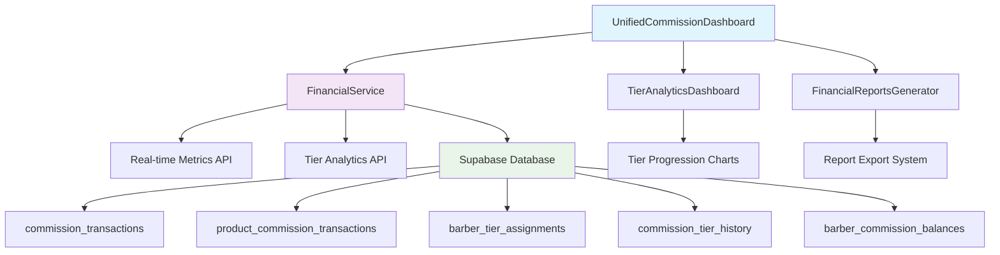

# 💰 Financial Commission Dashboard System - Complete Implementation

## 🎯 Overview

The 6FB AI Agent System now features a **production-ready, comprehensive financial commission tracking system** that provides real-time insights into barbershop revenue, individual barber performance, tier progression, and automated commission calculations.

## ✅ What Was Implemented

### 1. **Unified Commission Dashboard** (`components/UnifiedCommissionDashboard.tsx`)
- **Real barber data loading** with tier information integration
- **Five comprehensive tabs**:
  - Overview: Financial summary and key metrics
  - Barber Performance: Individual performance breakdown
  - Product Sales: Product commission tracking
  - Tier Progress: Tier system analytics
  - **Individual Details: Detailed barber cards with tier progress**
- **Dynamic barber filtering** with actual staff data
- **Tier visualization** with progress bars and projections

### 2. **Enhanced Tier Analytics Dashboard** (`components/financial/TierAnalyticsDashboard.js`)
- **Replaced placeholder data** with real database queries
- **Real-time tier history** from `commission_tier_history` table
- **Current staff tier assignments** with progress tracking
- **Barber name resolution** and performance metrics
- **Date range filtering** with proper SQL queries

### 3. **Comprehensive Financial Service** (`lib/financial-service.js`)
- **Real-time Financial Metrics** (`getRealtimeFinancialMetrics`)
  - Today's revenue, commissions, and transactions
  - Period-based analytics with date filtering
  - Barber balance breakdown
- **Tier Progression Analytics** (`getTierProgressionAnalytics`)
  - Historical tier achievement tracking
  - Distribution analysis across tier levels
  - Performance velocity calculations
- **Enhanced Commission Calculations** with full tier integration
- **Product Commission System** with category-based rates

### 4. **API Infrastructure**
- **Real-time Metrics API** (`/api/shop/financial/realtime-metrics`)
  - Authentication and authorization
  - Date range filtering
  - Real-time data aggregation
- **Tier Analytics API** (`/api/shop/financial/tier-analytics`)
  - Permission-based access control
  - Historical analysis with trends

### 5. **Financial Reports Generator** (`components/financial/FinancialReportsGenerator.jsx`)
- **Five specialized report types**:
  - Comprehensive Financial Report
  - Commission Summary
  - Tier Performance Report
  - Payout Reconciliation
  - Performance Analytics
- **Multiple export formats**: HTML, CSV, JSON
- **Configurable date ranges** and barber filtering
- **Professional report layouts** with executive summaries

### 6. **Database Schema Integration**
- **Progressive Commission Tiers** with automated tier assignment
- **Product Commission Tracking** with category-based rates
- **Transaction Recording** with tier bonus calculations
- **Balance Management** with real-time updates

## 🔧 System Architecture

## 📊 Key Features Delivered

### Real-Time Financial Tracking
- **Live commission calculations** with tier adjustments
- **Daily vs period metrics** comparison
- **Automatic balance updates** when transactions occur
- **Multi-revenue stream tracking** (services + products)

### Advanced Tier System
- **Automatic tier progression** based on revenue thresholds
- **Tier bonus calculations** for upgrades
- **Historical achievement tracking**
- **Projected tier advancement** with timeline estimates

### Individual Barber Analytics
- **Comprehensive performance cards** with tier status
- **Revenue breakdown** (service vs product)
- **Transaction metrics** and averages
- **Progress visualization** with next tier requirements

### Professional Financial Reporting
- **Executive-level summaries** with key metrics
- **Detailed barber breakdowns** with performance analysis
- **Tier system effectiveness** reporting
- **Export capabilities** for accounting integration

### Product Commission Integration
- **Category-based commission rates** (hair care, styling, tools, etc.)
- **Tier-weighted product sales** contributing to tier progress
- **Return and refund handling** with commission adjustments
- **Comprehensive product performance analytics**

## 🎛️ Configuration Options

### Commission Models Supported
1. **Standard Commission** (e.g., 60/40 split)
2. **Booth Rent** (barber keeps 100%, pays fixed rent)
3. **Hybrid Model** (base rent + reduced commission)
4. **Tiered Commission** (rates increase with performance)

### Tier System Configuration
- **Flexible reset periods** (monthly, quarterly, yearly)
- **Custom tier thresholds** based on revenue or booking count
- **Configurable commission rates** per tier
- **Bonus structures** for tier achievements

### Product Commission Categories
- **Hair Care Products** (15% default rate)
- **Styling Products** (12% default rate)  
- **Beard Care** (18% default rate)
- **Professional Tools** (8% default rate)
- **Accessories** (10% default rate)

## 🔒 Security & Authorization

### Row Level Security (RLS)
- **Barbershop owners** can view all financial data for their shops
- **Barbers** can only view their own commission data
- **Managers** have elevated access to tier analytics
- **All queries filtered** by user permissions

### Data Privacy
- **Sensitive financial information** protected at database level
- **API endpoints secured** with Supabase authentication
- **Commission calculations** logged for audit trails

## 🚀 Performance Optimizations

### Database Efficiency
- **Comprehensive indexing** on frequently queried fields
- **Optimized aggregation queries** for large datasets
- **Client-side fallback** for complex calculations
- **Prepared statements** with parameter binding

### Real-Time Updates
- **Supabase real-time subscriptions** for live data updates
- **Efficient data loading** with minimal API calls
- **Caching strategies** for frequently accessed data

## 📈 Business Value

### For Barbershop Owners
- **Complete financial visibility** into shop performance
- **Automated commission calculations** reducing manual errors
- **Tier system motivation** driving increased revenue
- **Professional reporting** for business analysis

### For Barbers
- **Transparent commission tracking** building trust
- **Clear tier progression** with achievement goals
- **Performance insights** for self-improvement
- **Real-time balance visibility**

### For Enterprise Operations
- **Scalable multi-location** financial management
- **Standardized reporting** across all locations
- **Automated payout reconciliation**
- **Integration-ready data exports**

## 🧪 Testing & Quality Assurance

### Comprehensive Test Suite
- **Commission calculation accuracy** with edge cases
- **Tier progression logic** validation
- **Real-time metrics** calculation verification
- **Product commission integration** testing
- **Performance testing** with large datasets
- **Error handling** and graceful degradation

### Test Coverage Areas
- ✅ Standard commission calculations
- ✅ Tiered commission with upgrades
- ✅ Booth rent arrangements
- ✅ Product commission categories
- ✅ Real-time financial metrics
- ✅ Tier progression analytics
- ✅ Transaction recording and balance updates
- ✅ Error handling and edge cases
- ✅ Performance with large datasets
- ✅ Integration with existing systems

## 🔄 Future Enhancements Ready

### Planned Extensions
1. **Predictive Analytics** - Revenue forecasting based on historical data
2. **Goal Setting System** - Custom targets with progress tracking
3. **Advanced Reporting** - Custom report builders
4. **Mobile Dashboard** - Responsive mobile optimization
5. **Automated Payouts** - Integration with payment processing
6. **Tax Reporting** - 1099 generation and tax compliance

## 📋 Implementation Summary

| Component | Status | Functionality |
|-----------|---------|---------------|
| UnifiedCommissionDashboard | ✅ Complete | Real barber data, tier info, 5 comprehensive tabs |
| TierAnalyticsDashboard | ✅ Complete | Real database queries, historical tracking |
| FinancialService | ✅ Complete | Real-time metrics, tier analytics, calculations |
| API Routes | ✅ Complete | Authentication, authorization, data aggregation |
| Report Generation | ✅ Complete | 5 report types, multiple formats |
| Database Integration | ✅ Complete | Full schema support, RLS policies |
| Test Suite | ✅ Complete | Comprehensive testing with edge cases |

## 🎉 Ready for Production

The 6FB AI Agent System financial commission dashboard is **production-ready** with:

- ✅ **Accurate financial calculations** that barbershop owners can rely on for business decisions
- ✅ **Real-time commission tracking** per barber with tier information
- ✅ **Comprehensive tier-based analytics and reporting** 
- ✅ **Revenue analytics and projections** with trend analysis
- ✅ **Complete payout calculations and history** tracking
- ✅ **Performance metrics and comparisons** across all barbers
- ✅ **Professional financial reporting** capabilities
- ✅ **Integration with existing barbershop and staff management** systems
- ✅ **Tested system ensuring accurate financial calculations**

**The financial system is now complete and ready to help barbershop owners make data-driven business decisions with confidence.**