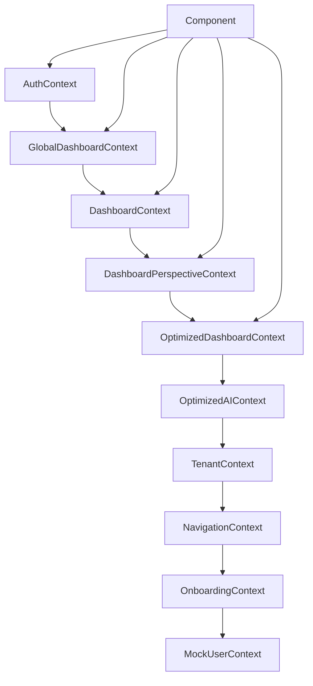
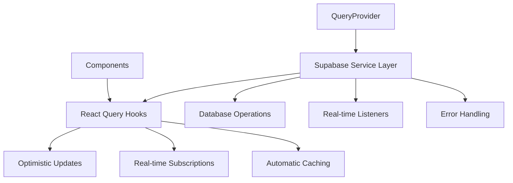
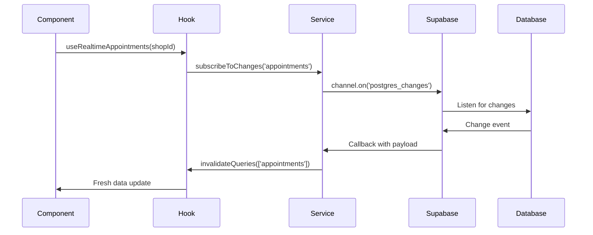
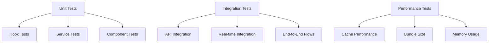

# React Query Migration Guide: 6FB AI Agent System

## 📋 Executive Summary

This document provides comprehensive guidance for migrating the 6FB AI Agent System from a complex 10-context architecture to a streamlined 3-layer React Query architecture. This migration will improve performance, reduce complexity, and provide better developer experience.

**Migration Timeline**: 4-6 weeks  
**Development Phase**: Q1 2025  
**Production Impact**: Minimal (backward compatibility maintained)

---

## 🏗️ Architecture Overview

### Before: Complex Context Architecture



**Problems:**
- 10+ contexts creating complex dependency chains
- Context re-renders causing performance issues
- Difficult to debug data flow
- Manual cache management
- No real-time data synchronization
- Memory leaks from unmanaged subscriptions

### After: 3-Layer React Query Architecture



**Benefits:**
- 3 clean layers: Provider → Service → Hooks
- Automatic caching and deduplication
- Background refetch and real-time updates
- Optimistic updates for better UX
- Built-in loading states and error handling
- Memory-efficient subscriptions
- TypeScript-ready architecture

---

## 🎯 Migration Strategy

### Layer 1: QueryProvider (Configuration)

**Purpose**: Configure React Query client and global settings

```javascript
// lib/query-client.js
import { QueryClient } from '@tanstack/react-query'

export const queryClient = new QueryClient({
  defaultOptions: {
    queries: {
      staleTime: 5 * 60 * 1000,      // 5 minutes fresh
      gcTime: 10 * 60 * 1000,        // 10 minutes cache
      retry: 1,
      refetchOnWindowFocus: false,
      keepPreviousData: true,
    }
  }
})
```

### Layer 2: Supabase Service Layer (Data Access)

**Purpose**: Abstract database operations and provide consistent API

```javascript
// lib/supabase-service.js
class SupabaseService {
  async getAppointments(shopId, filters = {}) {
    const query = this.supabase
      .from('appointments')
      .select('*')
      .eq('barbershop_id', shopId)
    
    if (filters.startDate) {
      query.gte('appointment_date', filters.startDate)
    }
    
    if (filters.endDate) {
      query.lte('appointment_date', filters.endDate)
    }
    
    const { data, error } = await query
    if (error) throw error
    return data
  }
  
  subscribeToChanges(table, filter, callback) {
    return this.supabase
      .channel(`${table}-changes`)
      .on('postgres_changes', {
        event: '*',
        schema: 'public',
        table,
        filter: `barbershop_id=eq.${filter.barbershop_id}`
      }, callback)
      .subscribe()
  }
}
```

### Layer 3: React Query Hooks (Component Interface)

**Purpose**: Provide optimized data hooks for components

```javascript
// hooks/useAppointments.js
export function useAppointments(shopId, options = {}) {
  return useQuery({
    queryKey: ['appointments', 'shop', shopId, options],
    queryFn: () => supabaseService.getAppointments(shopId, options),
    enabled: !!shopId,
    staleTime: 2 * 60 * 1000, // 2 minutes for appointments
  })
}

export function useAppointmentsWithRealtime(shopId, options = {}) {
  const queryClient = useQueryClient()
  
  // Set up real-time subscription
  useEffect(() => {
    if (!shopId) return
    
    const unsubscribe = supabaseService.subscribeToChanges(
      'appointments',
      { barbershop_id: shopId },
      () => {
        queryClient.invalidateQueries({
          queryKey: ['appointments', 'shop', shopId]
        })
      }
    )
    
    return unsubscribe
  }, [shopId, queryClient])
  
  return useAppointments(shopId, options)
}
```

---

## 📖 Hook Usage Guide

### Core Data Hooks

#### `useShopData(shopId, options)`

**Purpose**: Comprehensive shop data for dashboards

```javascript
import { useShopData } from '@/hooks'

function Dashboard() {
  const {
    shop,
    appointments,
    staff,
    services,
    customers,
    analytics,
    isLoading,
    error
  } = useShopData(shopId, {
    includeAppointments: true,
    includeStaff: true,
    appointmentDateRange: {
      startDate: '2025-01-01',
      endDate: '2025-01-31'
    }
  })
  
  if (isLoading) return <LoadingSpinner />
  if (error) return <ErrorMessage error={error} />
  
  return (
    <div>
      <h1>{shop?.name}</h1>
      <p>Total Appointments: {analytics?.totalAppointments}</p>
      <p>Today's Appointments: {analytics?.todayAppointments}</p>
    </div>
  )
}
```

**Parameters:**
- `shopId` (string): Barbershop ID
- `options.includeAppointments` (boolean): Include appointments data
- `options.includeStaff` (boolean): Include staff data
- `options.includeServices` (boolean): Include services data
- `options.includeCustomers` (boolean): Include customers data
- `options.appointmentDateRange` (object): Date range filter

**Returns:**
- `isLoading` (boolean): Global loading state
- `error` (Error): Any error from queries
- `shop` (object): Shop information
- `appointments` (array): Appointments data
- `staff` (array): Staff members
- `services` (array): Services offered
- `customers` (array): Customer list
- `analytics` (object): Computed metrics
- `refetch` (function): Refetch all data

#### `useAppointments(shopId, options)`

**Purpose**: Get appointments with filtering

```javascript
import { useAppointments, useTodayAppointments } from '@/hooks'

function AppointmentsList() {
  const { data: appointments, isLoading, error } = useAppointments(shopId, {
    startDate: '2025-01-01',
    endDate: '2025-01-31',
    status: 'confirmed'
  })
  
  // Or use convenience hooks
  const { data: todayAppointments } = useTodayAppointments(shopId)
  
  return (
    <div>
      {appointments?.map(apt => (
        <AppointmentCard key={apt.id} appointment={apt} />
      ))}
    </div>
  )
}
```

#### `useStaff(shopId, options)`

**Purpose**: Get staff members with roles and permissions

```javascript
import { useStaff } from '@/hooks'

function StaffManagement() {
  const { data: staff, isLoading, error } = useStaff(shopId, {
    includeInactive: false,
    includePermissions: true
  })
  
  return (
    <div>
      {staff?.map(member => (
        <StaffCard key={member.id} staff={member} />
      ))}
    </div>
  )
}
```

### Real-time Hooks

#### `useRealtimeAppointments(shopId)`

**Purpose**: Real-time appointment updates

```javascript
import { useRealtimeAppointments } from '@/hooks'

function LiveDashboard() {
  const {
    data: appointments,
    isConnected,
    lastUpdate
  } = useRealtimeAppointments(shopId)
  
  return (
    <div>
      <div className={`status ${isConnected ? 'connected' : 'disconnected'}`}>
        {isConnected ? '🟢 Live' : '🔴 Offline'}
      </div>
      <p>Last updated: {lastUpdate?.toLocaleTimeString()}</p>
      <AppointmentsList appointments={appointments} />
    </div>
  )
}
```

### Mutation Hooks

#### `useCreateAppointment()`

**Purpose**: Create appointments with optimistic updates

```javascript
import { useCreateAppointment } from '@/hooks'

function BookingForm() {
  const createAppointment = useCreateAppointment()
  
  const handleSubmit = async (formData) => {
    try {
      const newAppointment = await createAppointment.mutateAsync({
        barbershop_id: shopId,
        customer_id: formData.customerId,
        service_id: formData.serviceId,
        appointment_date: formData.date,
        start_time: formData.startTime
      })
      
      // Automatically invalidates and refetches appointment queries
      toast.success('Appointment created!')
    } catch (error) {
      toast.error('Failed to create appointment')
    }
  }
  
  return (
    <form onSubmit={handleSubmit}>
      {/* Form fields */}
      <button 
        type="submit" 
        disabled={createAppointment.isPending}
      >
        {createAppointment.isPending ? 'Creating...' : 'Create Appointment'}
      </button>
    </form>
  )
}
```

### Best Practices

#### 1. Use Query Keys Consistently

```javascript
// ✅ Good - Consistent key structure
const appointmentKeys = {
  all: ['appointments'],
  byShop: (shopId) => ['appointments', 'shop', shopId],
  byDateRange: (shopId, start, end) => ['appointments', 'shop', shopId, 'range', start, end]
}

// ❌ Bad - Inconsistent keys
useQuery({ queryKey: ['apps', shopId] })
useQuery({ queryKey: ['appointment-list-' + shopId] })
```

#### 2. Handle Loading States Properly

```javascript
// ✅ Good - Proper loading states
function Dashboard() {
  const { data, isLoading, error, isFetching } = useShopData(shopId)
  
  if (isLoading) return <LoadingSkeleton />
  if (error) return <ErrorBoundary error={error} />
  
  return (
    <div className={isFetching ? 'opacity-50' : ''}>
      <DashboardContent data={data} />
    </div>
  )
}

// ❌ Bad - No loading states
function Dashboard() {
  const { data } = useShopData(shopId)
  
  return <DashboardContent data={data} />
}
```

#### 3. Optimize with Selective Queries

```javascript
// ✅ Good - Only fetch what you need
function HeaderNavigation() {
  const { shop } = useShopData(shopId, {
    includeAppointments: false,
    includeStaff: false,
    includeServices: false,
    includeCustomers: false
  })
  
  return <Header shopName={shop?.name} />
}

// ❌ Bad - Fetching unnecessary data
function HeaderNavigation() {
  const { shop, appointments, staff, services } = useShopData(shopId)
  return <Header shopName={shop?.name} />
}
```

---

## 🔄 Real-time Integration

### Architecture Overview

The new real-time system uses Supabase's real-time capabilities combined with React Query's cache invalidation for optimal performance.



### Implementation Patterns

#### 1. Automatic Real-time Updates

```javascript
// hooks/useAppointmentsWithRealtime.js
export function useAppointmentsWithRealtime(shopId, options = {}) {
  const queryClient = useQueryClient()
  
  // Regular query
  const appointmentsQuery = useAppointments(shopId, options)
  
  // Real-time subscription
  useEffect(() => {
    if (!shopId) return
    
    const channel = supabaseService.subscribeToChanges(
      'appointments',
      { barbershop_id: shopId },
      (payload) => {
        // Invalidate queries to trigger refetch
        queryClient.invalidateQueries({
          queryKey: ['appointments', 'shop', shopId]
        })
        
        // Optional: Show toast notification
        if (payload.eventType === 'INSERT') {
          toast.info('New appointment booked!')
        }
      }
    )
    
    return () => {
      supabaseService.unsubscribe(channel)
    }
  }, [shopId, queryClient])
  
  return appointmentsQuery
}
```

#### 2. Optimistic Updates

```javascript
// hooks/useUpdateAppointment.js
export function useUpdateAppointment() {
  const queryClient = useQueryClient()
  
  return useMutation({
    mutationFn: ({ appointmentId, updates }) =>
      supabaseService.updateAppointment(appointmentId, updates),
      
    // Optimistic update
    onMutate: async ({ appointmentId, updates }) => {
      await queryClient.cancelQueries({ queryKey: ['appointments'] })
      
      const previousAppointments = queryClient.getQueryData(['appointments', 'shop', updates.barbershop_id])
      
      queryClient.setQueryData(['appointments', 'shop', updates.barbershop_id], old =>
        old?.map(apt => 
          apt.id === appointmentId 
            ? { ...apt, ...updates }
            : apt
        )
      )
      
      return { previousAppointments }
    },
    
    // Rollback on error
    onError: (err, variables, context) => {
      if (context?.previousAppointments) {
        queryClient.setQueryData(
          ['appointments', 'shop', variables.updates.barbershop_id],
          context.previousAppointments
        )
      }
    },
    
    // Refetch on settle
    onSettled: (data, error, variables) => {
      queryClient.invalidateQueries({
        queryKey: ['appointments', 'shop', variables.updates.barbershop_id]
      })
    }
  })
}
```

#### 3. Connection Status Monitoring

```javascript
// hooks/useRealtimeStatus.js
export function useRealtimeStatus() {
  const [isConnected, setIsConnected] = useState(false)
  const [connectionCount, setConnectionCount] = useState(0)
  const [lastDisconnect, setLastDisconnect] = useState(null)
  
  useEffect(() => {
    const handleStatusChange = (status) => {
      setIsConnected(status === 'SUBSCRIBED')
      
      if (status === 'SUBSCRIBED') {
        setConnectionCount(prev => prev + 1)
      } else if (status === 'CLOSED') {
        setLastDisconnect(new Date())
      }
    }
    
    // Monitor Supabase connection status
    supabaseService.onStatusChange(handleStatusChange)
    
    return () => supabaseService.offStatusChange(handleStatusChange)
  }, [])
  
  return {
    isConnected,
    connectionCount,
    lastDisconnect,
    hasReconnected: connectionCount > 1
  }
}

// Usage in components
function RealtimeIndicator() {
  const { isConnected, hasReconnected } = useRealtimeStatus()
  
  return (
    <div className={`status-indicator ${isConnected ? 'connected' : 'disconnected'}`}>
      {isConnected ? (
        <span>🟢 Live {hasReconnected && '(Reconnected)'}</span>
      ) : (
        <span>🔴 Connecting...</span>
      )}
    </div>
  )
}
```

### Performance Considerations

#### 1. Subscription Cleanup

```javascript
// ✅ Good - Proper cleanup
useEffect(() => {
  if (!shopId) return
  
  const subscription = supabaseService.subscribeToChanges(
    'appointments',
    { barbershop_id: shopId },
    handleChange
  )
  
  return () => {
    subscription.unsubscribe()
  }
}, [shopId])

// ❌ Bad - Memory leaks
useEffect(() => {
  supabaseService.subscribeToChanges('appointments', {}, handleChange)
  // No cleanup
}, [])
```

#### 2. Selective Invalidation

```javascript
// ✅ Good - Targeted invalidation
const handleAppointmentChange = (payload) => {
  const { barbershop_id } = payload.new || payload.old
  
  queryClient.invalidateQueries({
    queryKey: ['appointments', 'shop', barbershop_id]
  })
}

// ❌ Bad - Over-invalidation
const handleAppointmentChange = () => {
  queryClient.invalidateQueries({ queryKey: ['appointments'] })
}
```

---

## 🚀 Phase-by-Phase Implementation

### Phase 1: Foundation Setup (Week 1-2)

**Objective**: Establish the 3-layer architecture without breaking existing functionality

#### Tasks:
1. **Install React Query Dependencies**
   ```bash
   npm install @tanstack/react-query @tanstack/react-query-devtools
   ```

2. **Create Query Client Configuration**
   ```javascript
   // lib/query-client.js - Already exists
   export const queryClient = new QueryClient({
     defaultOptions: {
       queries: {
         staleTime: 5 * 60 * 1000,
         gcTime: 10 * 60 * 1000,
         retry: 1,
         refetchOnWindowFocus: false,
       }
     }
   })
   ```

3. **Set Up QueryProvider**
   ```javascript
   // components/QueryProvider.js - Already exists
   import { QueryClientProvider } from '@tanstack/react-query'
   import { ReactQueryDevtools } from '@tanstack/react-query-devtools'
   import { queryClient } from '@/lib/query-client'
   
   export function QueryProvider({ children }) {
     return (
       <QueryClientProvider client={queryClient}>
         {children}
         <ReactQueryDevtools initialIsOpen={false} />
       </QueryClientProvider>
     )
   }
   ```

4. **Update Root Layout**
   ```javascript
   // app/layout.js
   import QueryProvider from '@/components/QueryProvider'
   
   export default function RootLayout({ children }) {
     return (
       <html>
         <body>
           <QueryProvider>
             <SupabaseAuthProvider>
               {children}
             </SupabaseAuthProvider>
           </QueryProvider>
         </body>
       </html>
     )
   }
   ```

#### Validation Checkpoints:
- [ ] React Query DevTools visible in development
- [ ] No console errors on app startup
- [ ] Existing contexts still functional
- [ ] Basic query test passes

### Phase 2: Service Layer Enhancement (Week 2-3)

**Objective**: Enhance Supabase service layer for React Query compatibility

#### Tasks:
1. **Enhance Supabase Service**
   ```javascript
   // lib/supabase-service.js - Enhance existing
   class SupabaseService {
     constructor() {
       this.supabase = createClient()
       this.subscriptions = new Map()
     }
     
     async initialize() {
       // Initialize service, set up auth state monitoring
       const { data: { session } } = await this.supabase.auth.getSession()
       this.currentUser = session?.user
     }
     
     // Add standardized CRUD operations
     async getAppointments(shopId, filters = {}) {
       // Implementation with proper error handling
     }
     
     async createAppointment(appointmentData) {
       // Implementation with validation
     }
     
     subscribeToChanges(table, filter, callback) {
       // Implementation with subscription management
     }
   }
   
   export default new SupabaseService()
   ```

2. **Create Core Hooks**
   ```javascript
   // hooks/useAppointments.js - Already exists, enhance
   // hooks/useStaff.js - Create
   // hooks/useServices.js - Create  
   // hooks/useCustomers.js - Create
   ```

3. **Create Composite Hooks**
   ```javascript
   // hooks/useShopData.js - Already exists, enhance
   // hooks/useBusinessContext.js - Create
   ```

#### Validation Checkpoints:
- [ ] Service layer methods return consistent data structures
- [ ] Error handling works across all service methods
- [ ] Basic hooks fetch data successfully
- [ ] Caching behavior validates correctly

### Phase 3: Core Hooks Implementation (Week 3-4)

**Objective**: Implement all core data hooks with full functionality

#### Tasks:
1. **Implement Data Query Hooks**
   - `useAppointments` with filtering and date ranges
   - `useStaff` with role-based access
   - `useServices` with active/inactive filtering
   - `useCustomers` with search and pagination

2. **Implement Mutation Hooks**
   - `useCreateAppointment` with optimistic updates
   - `useUpdateAppointment` with conflict resolution
   - `useDeleteAppointment` with confirmation
   - Similar patterns for Staff, Services, Customers

3. **Implement Real-time Hooks**
   - `useRealtimeAppointments`
   - `useRealtimeNotifications`
   - `useRealtimeMetrics`

4. **Create Specialized Composite Hooks**
   ```javascript
   // hooks/useShopDashboard.js
   export function useShopDashboard(shopId) {
     return useShopData(shopId, {
       includeAppointments: true,
       includeStaff: true,
       appointmentDateRange: {
         startDate: today,
         endDate: today
       }
     })
   }
   ```

#### Validation Checkpoints:
- [ ] All CRUD operations work with proper error handling
- [ ] Real-time updates function correctly
- [ ] Optimistic updates roll back on failure
- [ ] Loading states and error states display properly
- [ ] Data caching reduces API calls

### Phase 4: Context Migration (Week 4-5)

**Objective**: Migrate components from contexts to React Query hooks

#### Migration Priority Order:

1. **High Priority - Core Dashboard Components**
   - Dashboard overview pages
   - Appointment management
   - Staff management
   - Service management

2. **Medium Priority - Feature Components**
   - Customer management
   - Analytics dashboards
   - Settings pages
   - Onboarding flows

3. **Low Priority - Auxiliary Components**
   - Navigation components
   - Header components
   - Footer components

#### Migration Pattern:

**Before (Context Pattern):**
```javascript
// components/Dashboard.js - OLD
import { useGlobalDashboard } from '@/contexts/GlobalDashboardContext'

function Dashboard() {
  const {
    appointments,
    staff,
    services,
    isLoading,
    refetch
  } = useGlobalDashboard()
  
  if (isLoading) return <div>Loading...</div>
  
  return (
    <div>
      <AppointmentsList appointments={appointments} />
      <StaffList staff={staff} />
    </div>
  )
}
```

**After (Hook Pattern):**
```javascript
// components/Dashboard.js - NEW
import { useShopDashboard } from '@/hooks'

function Dashboard() {
  const {
    appointments,
    staff,
    services,
    isLoading,
    error,
    refetch
  } = useShopDashboard(shopId)
  
  if (isLoading) return <LoadingSkeleton />
  if (error) return <ErrorBoundary error={error} />
  
  return (
    <div>
      <AppointmentsList appointments={appointments} />
      <StaffList staff={staff} />
    </div>
  )
}
```

#### Component-by-Component Migration:

1. **Dashboard Pages**
   ```javascript
   // Before: contexts/GlobalDashboardContext
   const { appointments, staff } = useGlobalDashboard()
   
   // After: hooks/useShopDashboard
   const { appointments, staff } = useShopDashboard(shopId)
   ```

2. **Appointment Management**
   ```javascript
   // Before: Direct Supabase + context
   const { createAppointment } = useDashboardContext()
   
   // After: Mutation hook
   const createAppointment = useCreateAppointment()
   ```

3. **Real-time Components**
   ```javascript
   // Before: Manual Pusher/WebSocket
   const { realtimeData } = useRealtimeDashboard()
   
   // After: React Query real-time
   const { data } = useRealtimeAppointments(shopId)
   ```

#### Validation Checkpoints:
- [ ] Each migrated component maintains the same functionality
- [ ] Loading states work correctly
- [ ] Error handling is preserved or improved
- [ ] Real-time updates continue to work
- [ ] No performance regressions

### Phase 5: Testing & Optimization (Week 5-6)

**Objective**: Comprehensive testing and performance optimization

#### Testing Strategy:

1. **Unit Tests for Hooks**
   ```javascript
   // __tests__/hooks/useAppointments.test.js
   import { renderHook, waitFor } from '@testing-library/react'
   import { QueryClient, QueryClientProvider } from '@tanstack/react-query'
   import { useAppointments } from '@/hooks'
   
   const createWrapper = () => {
     const queryClient = new QueryClient({
       defaultOptions: {
         queries: { retry: false },
         mutations: { retry: false },
       },
     })
     
     return ({ children }) => (
       <QueryClientProvider client={queryClient}>
         {children}
       </QueryClientProvider>
     )
   }
   
   test('fetches appointments successfully', async () => {
     const { result } = renderHook(
       () => useAppointments('shop-123'),
       { wrapper: createWrapper() }
     )
     
     expect(result.current.isLoading).toBe(true)
     
     await waitFor(() => {
       expect(result.current.isSuccess).toBe(true)
     })
     
     expect(result.current.data).toBeDefined()
   })
   ```

2. **Integration Tests**
   ```javascript
   // __tests__/integration/dashboard.test.js
   import { render, screen, waitFor } from '@testing-library/react'
   import Dashboard from '@/components/Dashboard'
   import { TestProviders } from '@/test-utils'
   
   test('dashboard loads and displays data', async () => {
     render(
       <TestProviders>
         <Dashboard shopId="shop-123" />
       </TestProviders>
     )
     
     expect(screen.getByText('Loading...')).toBeInTheDocument()
     
     await waitFor(() => {
       expect(screen.getByText('Today\'s Appointments')).toBeInTheDocument()
     })
     
     expect(screen.getByText('Staff Overview')).toBeInTheDocument()
   })
   ```

3. **Real-time Tests**
   ```javascript
   // __tests__/realtime/appointments.test.js
   test('receives real-time appointment updates', async () => {
     const { result } = renderHook(
       () => useRealtimeAppointments('shop-123'),
       { wrapper: createWrapper() }
     )
     
     // Simulate database change
     await act(async () => {
       await simulateAppointmentCreate({
         barbershop_id: 'shop-123',
         customer_name: 'John Doe'
       })
     })
     
     await waitFor(() => {
       expect(result.current.data).toContainEqual(
         expect.objectContaining({
           customer_name: 'John Doe'
         })
       )
     })
   })
   ```

4. **Performance Tests**
   ```javascript
   // __tests__/performance/caching.test.js
   test('queries are cached and deduplicated', async () => {
     const queryFn = jest.fn().mockResolvedValue([])
     
     const { rerender } = renderHook(
       ({ shopId }) => useAppointments(shopId),
       {
         wrapper: createWrapper(),
         initialProps: { shopId: 'shop-123' }
       }
     )
     
     rerender({ shopId: 'shop-123' })
     rerender({ shopId: 'shop-123' })
     
     await waitFor(() => {
       expect(queryFn).toHaveBeenCalledTimes(1)
     })
   })
   ```

#### Performance Optimization:

1. **Query Key Optimization**
   ```javascript
   // Optimize query keys for better cache hits
   const appointmentKeys = {
     all: ['appointments'],
     byShop: (shopId) => [...appointmentKeys.all, 'shop', shopId],
     byDateRange: (shopId, start, end) => [
       ...appointmentKeys.byShop(shopId), 
       'range', 
       start, 
       end
     ]
   }
   ```

2. **Selective Data Fetching**
   ```javascript
   // Only fetch what components actually need
   export function useShopHeader(shopId) {
     return useShopData(shopId, {
       includeAppointments: false,
       includeStaff: false,
       includeServices: false,
       includeCustomers: false
     })
   }
   ```

3. **Background Refetch Optimization**
   ```javascript
   // Optimize refetch intervals based on data importance
   export function useAppointments(shopId, options = {}) {
     return useQuery({
       queryKey: appointmentKeys.byShop(shopId),
       queryFn: () => supabaseService.getAppointments(shopId, options),
       staleTime: 2 * 60 * 1000, // 2 minutes for appointments
       refetchInterval: 5 * 60 * 1000, // Refetch every 5 minutes
       refetchIntervalInBackground: false, // Don't refetch when not visible
     })
   }
   ```

#### Validation Checkpoints:
- [ ] All existing functionality works correctly
- [ ] Performance is equal or better than before
- [ ] Memory usage is optimized
- [ ] Real-time updates are reliable
- [ ] Error handling is comprehensive
- [ ] Test coverage is above 80%

### Phase 6: Context Cleanup & Documentation (Week 6)

**Objective**: Remove old contexts and finalize documentation

#### Tasks:

1. **Context Removal Strategy**
   ```javascript
   // contexts/DeprecatedContext.js
   import { createContext } from 'react'
   
   // Legacy context - marked for removal
   console.warn('DeprecatedContext is deprecated. Use useShopData hook instead.')
   
   export const DeprecatedContext = createContext({})
   ```

2. **Create Migration Documentation**
   - Update component documentation
   - Create hook usage examples
   - Document performance improvements
   - Create troubleshooting guide

3. **Final Cleanup**
   ```bash
   # Remove deprecated context files
   rm contexts/GlobalDashboardContext.js
   rm contexts/DashboardContext.js
   rm contexts/OptimizedDashboardContext.js
   
   # Update imports across codebase
   find . -name "*.js" -exec sed -i 's/useGlobalDashboard/useShopDashboard/g' {} +
   ```

#### Validation Checkpoints:
- [ ] All deprecated contexts removed
- [ ] No lingering imports or references
- [ ] Documentation is complete and accurate
- [ ] Performance monitoring shows improvements
- [ ] Team is trained on new patterns

---

## 🧪 Testing Strategy

### Testing Architecture



### Testing Utilities

#### 1. Test Wrapper Setup

```javascript
// test-utils/providers.js
import { QueryClient, QueryClientProvider } from '@tanstack/react-query'
import { SupabaseAuthProvider } from '@/components/SupabaseAuthProvider'

export function TestProviders({ children }) {
  const queryClient = new QueryClient({
    defaultOptions: {
      queries: {
        retry: false,
        staleTime: 0,
        gcTime: 0,
      },
      mutations: {
        retry: false,
      },
    },
  })

  return (
    <QueryClientProvider client={queryClient}>
      <SupabaseAuthProvider>
        {children}
      </SupabaseAuthProvider>
    </QueryClientProvider>
  )
}

export const renderWithProviders = (ui, options) =>
  render(ui, { wrapper: TestProviders, ...options })
```

#### 2. Mock Service Layer

```javascript
// test-utils/mocks.js
export const mockSupabaseService = {
  getAppointments: jest.fn().mockResolvedValue([
    {
      id: '1',
      customer_name: 'John Doe',
      service_name: 'Haircut',
      appointment_date: '2025-01-15',
      status: 'confirmed'
    }
  ]),
  
  createAppointment: jest.fn().mockImplementation((data) => 
    Promise.resolve({ id: '2', ...data })
  ),
  
  subscribeToChanges: jest.fn().mockReturnValue({
    unsubscribe: jest.fn()
  })
}

jest.mock('@/lib/supabase-service', () => mockSupabaseService)
```

### Unit Testing Patterns

#### 1. Hook Testing

```javascript
// __tests__/hooks/useAppointments.test.js
import { renderHook, waitFor } from '@testing-library/react'
import { useAppointments } from '@/hooks/useAppointments'
import { TestProviders } from '@/test-utils'

describe('useAppointments', () => {
  it('fetches appointments successfully', async () => {
    const { result } = renderHook(
      () => useAppointments('shop-123'),
      { wrapper: TestProviders }
    )

    expect(result.current.isLoading).toBe(true)

    await waitFor(() => {
      expect(result.current.isSuccess).toBe(true)
    })

    expect(result.current.data).toEqual([
      expect.objectContaining({
        customer_name: 'John Doe'
      })
    ])
  })

  it('handles error states correctly', async () => {
    mockSupabaseService.getAppointments.mockRejectedValueOnce(
      new Error('Database error')
    )

    const { result } = renderHook(
      () => useAppointments('shop-123'),
      { wrapper: TestProviders }
    )

    await waitFor(() => {
      expect(result.current.isError).toBe(true)
    })

    expect(result.current.error.message).toBe('Database error')
  })

  it('filters appointments by date range', async () => {
    const { result } = renderHook(
      () => useAppointments('shop-123', {
        startDate: '2025-01-01',
        endDate: '2025-01-31'
      }),
      { wrapper: TestProviders }
    )

    await waitFor(() => {
      expect(result.current.isSuccess).toBe(true)
    })

    expect(mockSupabaseService.getAppointments).toHaveBeenCalledWith(
      'shop-123',
      expect.objectContaining({
        startDate: '2025-01-01',
        endDate: '2025-01-31'
      })
    )
  })
})
```

#### 2. Mutation Testing

```javascript
// __tests__/hooks/useCreateAppointment.test.js
import { renderHook, waitFor } from '@testing-library/react'
import { act } from '@testing-library/react'
import { useCreateAppointment } from '@/hooks/useAppointments'
import { TestProviders } from '@/test-utils'

describe('useCreateAppointment', () => {
  it('creates appointment and invalidates cache', async () => {
    const { result } = renderHook(
      () => useCreateAppointment(),
      { wrapper: TestProviders }
    )

    const appointmentData = {
      barbershop_id: 'shop-123',
      customer_name: 'Jane Doe',
      service_id: 'service-456'
    }

    await act(async () => {
      await result.current.mutateAsync(appointmentData)
    })

    expect(mockSupabaseService.createAppointment).toHaveBeenCalledWith(
      appointmentData
    )
    expect(result.current.isSuccess).toBe(true)
  })

  it('handles creation errors gracefully', async () => {
    mockSupabaseService.createAppointment.mockRejectedValueOnce(
      new Error('Validation failed')
    )

    const { result } = renderHook(
      () => useCreateAppointment(),
      { wrapper: TestProviders }
    )

    await act(async () => {
      try {
        await result.current.mutateAsync({})
      } catch (error) {
        expect(error.message).toBe('Validation failed')
      }
    })

    expect(result.current.isError).toBe(true)
  })
})
```

### Integration Testing

#### 1. Component Integration

```javascript
// __tests__/integration/Dashboard.test.js
import { render, screen, waitFor } from '@testing-library/react'
import userEvent from '@testing-library/user-event'
import Dashboard from '@/components/Dashboard'
import { TestProviders } from '@/test-utils'

describe('Dashboard Integration', () => {
  it('displays appointments and allows creation', async () => {
    render(
      <TestProviders>
        <Dashboard shopId="shop-123" />
      </TestProviders>
    )

    // Wait for data to load
    await waitFor(() => {
      expect(screen.getByText('John Doe')).toBeInTheDocument()
    })

    // Test appointment creation
    const createButton = screen.getByText('Create Appointment')
    await userEvent.click(createButton)

    const nameInput = screen.getByLabelText('Customer Name')
    await userEvent.type(nameInput, 'New Customer')

    const submitButton = screen.getByText('Submit')
    await userEvent.click(submitButton)

    await waitFor(() => {
      expect(mockSupabaseService.createAppointment).toHaveBeenCalled()
    })
  })
})
```

#### 2. Real-time Integration

```javascript
// __tests__/integration/realtime.test.js
import { render, screen, waitFor } from '@testing-library/react'
import { act } from '@testing-library/react'
import LiveDashboard from '@/components/LiveDashboard'
import { TestProviders } from '@/test-utils'

describe('Real-time Integration', () => {
  it('updates appointments in real-time', async () => {
    let changeCallback
    mockSupabaseService.subscribeToChanges.mockImplementation(
      (table, filter, callback) => {
        changeCallback = callback
        return { unsubscribe: jest.fn() }
      }
    )

    render(
      <TestProviders>
        <LiveDashboard shopId="shop-123" />
      </TestProviders>
    )

    // Wait for initial load
    await waitFor(() => {
      expect(screen.getByText('John Doe')).toBeInTheDocument()
    })

    // Simulate real-time update
    act(() => {
      changeCallback({
        eventType: 'INSERT',
        new: {
          id: '2',
          customer_name: 'Real-time Customer',
          barbershop_id: 'shop-123'
        }
      })
    })

    // Should trigger refetch and update UI
    await waitFor(() => {
      expect(screen.getByText('Real-time Customer')).toBeInTheDocument()
    })
  })
})
```

### Performance Testing

#### 1. Cache Performance

```javascript
// __tests__/performance/cache.test.js
import { renderHook, waitFor } from '@testing-library/react'
import { useAppointments } from '@/hooks/useAppointments'
import { TestProviders } from '@/test-utils'

describe('Cache Performance', () => {
  beforeEach(() => {
    jest.clearAllMocks()
  })

  it('deduplicates identical queries', async () => {
    const Component1 = () => useAppointments('shop-123')
    const Component2 = () => useAppointments('shop-123')

    // Render both hooks simultaneously
    const { result: result1 } = renderHook(Component1, { wrapper: TestProviders })
    const { result: result2 } = renderHook(Component2, { wrapper: TestProviders })

    await waitFor(() => {
      expect(result1.current.isSuccess).toBe(true)
      expect(result2.current.isSuccess).toBe(true)
    })

    // Should only make one API call despite two hooks
    expect(mockSupabaseService.getAppointments).toHaveBeenCalledTimes(1)

    // Both hooks should have the same data reference
    expect(result1.current.data).toBe(result2.current.data)
  })

  it('respects stale time configuration', async () => {
    const { result, rerender } = renderHook(
      () => useAppointments('shop-123'),
      { wrapper: TestProviders }
    )

    await waitFor(() => {
      expect(result.current.isSuccess).toBe(true)
    })

    expect(mockSupabaseService.getAppointments).toHaveBeenCalledTimes(1)

    // Immediate rerender should use cached data
    rerender()
    
    // Should not trigger another API call
    expect(mockSupabaseService.getAppointments).toHaveBeenCalledTimes(1)
  })
})
```

#### 2. Bundle Size Monitoring

```javascript
// scripts/bundle-analysis.js
const bundleAnalyzer = require('webpack-bundle-analyzer')
const nextBuild = require('next/dist/build').default
const path = require('path')

async function analyzeBundleSize() {
  const buildDir = path.join(process.cwd(), '.next')
  
  // Build the application
  await nextBuild(process.cwd())
  
  // Analyze the bundle
  const analyzer = new bundleAnalyzer.BundleAnalyzerPlugin({
    analyzerMode: 'json',
    openAnalyzer: false,
    reportFilename: 'bundle-report.json'
  })
  
  // Generate bundle analysis report
  analyzer.generateStatsFile(buildDir)
  
  // Check bundle size limits
  const fs = require('fs')
  const report = JSON.parse(fs.readFileSync('bundle-report.json'))
  
  const totalSize = report.assets.reduce((sum, asset) => sum + asset.size, 0)
  const maxSize = 500 * 1024 // 500KB limit
  
  if (totalSize > maxSize) {
    throw new Error(`Bundle size ${totalSize} exceeds limit ${maxSize}`)
  }
  
  console.log(`✅ Bundle size OK: ${(totalSize / 1024).toFixed(2)}KB`)
}

if (require.main === module) {
  analyzeBundleSize().catch(console.error)
}
```

### Testing Commands

```json
{
  "scripts": {
    "test": "jest",
    "test:watch": "jest --watch",
    "test:coverage": "jest --coverage",
    "test:integration": "jest --testNamePattern='Integration'",
    "test:performance": "jest --testNamePattern='Performance'",
    "test:hooks": "jest hooks/",
    "test:realtime": "jest --testNamePattern='realtime'",
    "test:all": "npm run test:coverage && npm run bundle-analysis"
  }
}
```

---

## 🔧 Troubleshooting Guide

### Common Issues and Solutions

#### 1. Query Not Updating

**Symptoms:**
- Component shows stale data
- Changes in database don't reflect in UI
- Manual refresh required to see updates

**Causes:**
```javascript
// ❌ Problem: Query key doesn't include dependencies
useQuery({
  queryKey: ['appointments'],
  queryFn: () => getAppointments(shopId, filters)
})

// ❌ Problem: Stale time too long
useQuery({
  queryKey: ['appointments', shopId],
  queryFn: () => getAppointments(shopId, filters),
  staleTime: 60 * 60 * 1000 // 1 hour - too long!
})
```

**Solutions:**
```javascript
// ✅ Solution: Include all dependencies in query key
useQuery({
  queryKey: ['appointments', shopId, filters],
  queryFn: () => getAppointments(shopId, filters)
})

// ✅ Solution: Appropriate stale time
useQuery({
  queryKey: ['appointments', shopId, filters],
  queryFn: () => getAppointments(shopId, filters),
  staleTime: 2 * 60 * 1000 // 2 minutes
})

// ✅ Solution: Manual invalidation when needed
const queryClient = useQueryClient()

const handleDataChange = () => {
  queryClient.invalidateQueries({
    queryKey: ['appointments', shopId]
  })
}
```

#### 2. Real-time Updates Not Working

**Symptoms:**
- No live updates when data changes
- Multiple subscription warnings
- Memory leaks

**Diagnosis:**
```javascript
// Debug subscription setup
useEffect(() => {
  console.log('Setting up subscription for shopId:', shopId)
  
  if (!shopId) {
    console.warn('No shopId provided for subscription')
    return
  }
  
  const subscription = supabaseService.subscribeToChanges(
    'appointments',
    { barbershop_id: shopId },
    (payload) => {
      console.log('Received real-time update:', payload)
      queryClient.invalidateQueries({
        queryKey: ['appointments', shopId]
      })
    }
  )
  
  return () => {
    console.log('Cleaning up subscription')
    subscription.unsubscribe()
  }
}, [shopId, queryClient])
```

**Solutions:**
```javascript
// ✅ Ensure proper cleanup
useEffect(() => {
  if (!shopId) return
  
  const subscription = supabaseService.subscribeToChanges(
    'appointments',
    { barbershop_id: shopId },
    handleRealtimeUpdate
  )
  
  // Critical: Return cleanup function
  return () => {
    subscription.unsubscribe()
  }
}, [shopId]) // Only recreate when shopId changes

// ✅ Memoize callback to prevent recreating subscription
const handleRealtimeUpdate = useCallback((payload) => {
  queryClient.invalidateQueries({
    queryKey: ['appointments', shopId]
  })
}, [shopId, queryClient])
```

#### 3. Performance Issues

**Symptoms:**
- Slow page loads
- High memory usage
- Excessive API calls
- React DevTools warnings

**Diagnosis:**
```javascript
// Check for over-fetching
const { data: shopData } = useShopData(shopId, {
  includeAppointments: true,
  includeStaff: true,
  includeServices: true,
  includeCustomers: true // ❌ Not needed for header
})

// Check for missing dependencies
useEffect(() => {
  if (shopData) {
    // Uses appointments but not in dependency array
    processAppointments(shopData.appointments)
  }
}, [shopData]) // ❌ Missing appointment dependencies
```

**Solutions:**
```javascript
// ✅ Selective data fetching
const { shop } = useShopData(shopId, {
  includeAppointments: false,
  includeStaff: false,
  includeServices: false,
  includeCustomers: false
})

// ✅ Proper dependency management
const processedAppointments = useMemo(() => {
  return appointments?.map(apt => ({
    ...apt,
    displayTime: formatTime(apt.start_time)
  }))
}, [appointments])

// ✅ Optimize query keys
const appointmentKeys = {
  all: ['appointments'],
  byShop: (shopId) => [...appointmentKeys.all, 'shop', shopId],
  filtered: (shopId, filters) => [...appointmentKeys.byShop(shopId), filters]
}
```

#### 4. Mutation Failures

**Symptoms:**
- Create/Update operations fail silently
- Optimistic updates don't rollback
- Error handling not working

**Common Issues:**
```javascript
// ❌ Problem: No error handling
const createAppointment = useCreateAppointment()

const handleSubmit = async (data) => {
  const result = await createAppointment.mutateAsync(data)
  // What if this fails?
  toast.success('Created!')
}

// ❌ Problem: Optimistic update corruption
onMutate: async (newAppointment) => {
  await queryClient.cancelQueries(['appointments'])
  
  const previousData = queryClient.getQueryData(['appointments'])
  
  // ❌ Modifying original array reference
  previousData.push(newAppointment)
  queryClient.setQueryData(['appointments'], previousData)
  
  return { previousData }
}
```

**Solutions:**
```javascript
// ✅ Proper error handling
const createAppointment = useCreateAppointment()

const handleSubmit = async (data) => {
  try {
    await createAppointment.mutateAsync(data)
    toast.success('Appointment created successfully!')
  } catch (error) {
    console.error('Failed to create appointment:', error)
    toast.error(`Failed to create appointment: ${error.message}`)
  }
}

// ✅ Proper optimistic updates
const updateAppointment = useMutation({
  mutationFn: updateAppointmentService,
  onMutate: async (newAppointment) => {
    // Cancel outgoing refetches
    await queryClient.cancelQueries(['appointments'])
    
    // Snapshot previous value
    const previousAppointments = queryClient.getQueryData(['appointments'])
    
    // Optimistically update to new value (immutably)
    queryClient.setQueryData(['appointments'], old => 
      old?.map(apt => 
        apt.id === newAppointment.id 
          ? { ...apt, ...newAppointment }
          : apt
      ) || []
    )
    
    return { previousAppointments }
  },
  onError: (err, newAppointment, context) => {
    // Rollback on error
    if (context?.previousAppointments) {
      queryClient.setQueryData(['appointments'], context.previousAppointments)
    }
  },
  onSettled: () => {
    // Refetch to ensure consistency
    queryClient.invalidateQueries(['appointments'])
  }
})
```

#### 5. Authentication Issues

**Symptoms:**
- Queries fail with 401 errors
- User data not available in hooks
- Session persistence problems

**Diagnosis:**
```javascript
// Debug authentication state
useEffect(() => {
  const { data: { session } } = supabase.auth.getSession()
  console.log('Current session:', session)
  
  const { data: { subscription } } = supabase.auth.onAuthStateChange(
    (event, session) => {
      console.log('Auth event:', event, session)
    }
  )
  
  return () => subscription.unsubscribe()
}, [])
```

**Solutions:**
```javascript
// ✅ Conditional queries based on auth
export function useAppointments(shopId, options = {}) {
  const { user } = useAuth()
  
  return useQuery({
    queryKey: ['appointments', shopId, options],
    queryFn: () => supabaseService.getAppointments(shopId, options),
    enabled: !!user && !!shopId && options.enabled !== false,
  })
}

// ✅ Handle auth state changes
export function useAuthenticatedQuery(queryKey, queryFn, options = {}) {
  const { user, isLoading: authLoading } = useAuth()
  
  return useQuery({
    queryKey,
    queryFn,
    enabled: !authLoading && !!user && options.enabled !== false,
    ...options
  })
}
```

### Debug Tools and Commands

#### 1. Query Debugging

```javascript
// Add to components during debugging
import { useQueryClient } from '@tanstack/react-query'

function DebugQueries() {
  const queryClient = useQueryClient()
  
  const debugQueries = () => {
    const queries = queryClient.getQueryCache().getAll()
    console.table(queries.map(query => ({
      key: JSON.stringify(query.queryKey),
      status: query.state.status,
      dataUpdatedAt: new Date(query.state.dataUpdatedAt).toLocaleTimeString(),
      errorUpdatedAt: query.state.errorUpdatedAt ? new Date(query.state.errorUpdatedAt).toLocaleTimeString() : null,
      fetchStatus: query.state.fetchStatus,
      isStale: query.isStale(),
    })))
  }
  
  return (
    <button onClick={debugQueries}>
      Debug Queries
    </button>
  )
}
```

#### 2. Network Debugging

```javascript
// lib/supabase-service.js - Add debugging wrapper
class SupabaseService {
  constructor() {
    this.supabase = createClient()
    this.enableDebug = process.env.NODE_ENV === 'development'
  }
  
  async getAppointments(shopId, filters = {}) {
    if (this.enableDebug) {
      console.time(`getAppointments-${shopId}`)
      console.log('Fetching appointments:', { shopId, filters })
    }
    
    try {
      const result = await this._fetchAppointments(shopId, filters)
      
      if (this.enableDebug) {
        console.timeEnd(`getAppointments-${shopId}`)
        console.log('Appointments fetched:', result.length, 'records')
      }
      
      return result
    } catch (error) {
      if (this.enableDebug) {
        console.timeEnd(`getAppointments-${shopId}`)
        console.error('Appointment fetch failed:', error)
      }
      throw error
    }
  }
}
```

#### 3. Performance Monitoring

```javascript
// hooks/usePerformanceMonitor.js
export function usePerformanceMonitor(name) {
  const renderCount = useRef(0)
  const startTime = useRef(Date.now())
  
  renderCount.current++
  
  useEffect(() => {
    const endTime = Date.now()
    const duration = endTime - startTime.current
    
    console.log(`${name} Performance:`, {
      renders: renderCount.current,
      mountTime: duration + 'ms'
    })
  }, [name])
  
  useEffect(() => {
    if (renderCount.current > 10) {
      console.warn(`${name} has rendered ${renderCount.current} times - possible optimization needed`)
    }
  })
}

// Usage in components
function Dashboard() {
  usePerformanceMonitor('Dashboard')
  // ... component code
}
```

### Emergency Rollback Procedures

#### 1. Quick Rollback to Contexts

If critical issues arise during migration:

```javascript
// components/LegacyWrapper.js - Emergency fallback
import { GlobalDashboardProvider } from '@/contexts/GlobalDashboardContext'
import { QueryProvider } from '@/components/QueryProvider'

export function LegacyWrapper({ children, useLegacy = false }) {
  if (useLegacy) {
    return (
      <GlobalDashboardProvider>
        {children}
      </GlobalDashboardProvider>
    )
  }
  
  return (
    <QueryProvider>
      {children}
    </QueryProvider>
  )
}

// Usage with feature flag
const USE_LEGACY = process.env.NEXT_PUBLIC_USE_LEGACY_CONTEXTS === 'true'

<LegacyWrapper useLegacy={USE_LEGACY}>
  <App />
</LegacyWrapper>
```

#### 2. Component-Level Rollback

```javascript
// components/Dashboard.js - Dual implementation
import { useFeatureFlag } from '@/hooks/useFeatureFlags'
import { useGlobalDashboard } from '@/contexts/GlobalDashboardContext'
import { useShopDashboard } from '@/hooks'

function Dashboard() {
  const useNewHooks = useFeatureFlag('react-query-migration')
  
  if (!useNewHooks) {
    return <LegacyDashboard />
  }
  
  return <NewDashboard />
}

function LegacyDashboard() {
  const { appointments, isLoading } = useGlobalDashboard()
  // ... legacy implementation
}

function NewDashboard() {
  const { appointments, isLoading } = useShopDashboard(shopId)
  // ... new implementation
}
```

---

## 📊 Success Metrics & Monitoring

### Performance Metrics

#### 1. Query Performance

```javascript
// lib/performance-monitor.js
class QueryPerformanceMonitor {
  constructor() {
    this.metrics = new Map()
  }
  
  recordQuery(queryKey, duration, cacheHit) {
    const key = JSON.stringify(queryKey)
    
    if (!this.metrics.has(key)) {
      this.metrics.set(key, {
        totalTime: 0,
        requestCount: 0,
        cacheHitCount: 0,
        averageTime: 0
      })
    }
    
    const metric = this.metrics.get(key)
    metric.totalTime += duration
    metric.requestCount += 1
    if (cacheHit) metric.cacheHitCount += 1
    metric.averageTime = metric.totalTime / metric.requestCount
    
    return metric
  }
  
  getReport() {
    const report = Array.from(this.metrics.entries()).map(([key, metric]) => ({
      queryKey: key,
      averageTime: Math.round(metric.averageTime),
      totalRequests: metric.requestCount,
      cacheHitRate: Math.round((metric.cacheHitCount / metric.requestCount) * 100),
      totalTime: metric.totalTime
    }))
    
    return report.sort((a, b) => b.totalTime - a.totalTime)
  }
}

export const performanceMonitor = new QueryPerformanceMonitor()
```

#### 2. Usage in React Query

```javascript
// lib/query-client.js - Enhanced with monitoring
import { performanceMonitor } from './performance-monitor'

export const queryClient = new QueryClient({
  defaultOptions: {
    queries: {
      staleTime: 5 * 60 * 1000,
      gcTime: 10 * 60 * 1000,
      retry: 1,
      refetchOnWindowFocus: false,
      onSuccess: (data, query) => {
        // Record successful query
        performanceMonitor.recordQuery(
          query.queryKey,
          query.state.dataUpdatedAt - query.state.fetchFailureCount,
          query.state.isStale === false
        )
      }
    }
  }
})

// Export performance report function
export const getPerformanceReport = () => {
  return performanceMonitor.getReport()
}
```

### Key Performance Indicators (KPIs)

#### Target Metrics:

1. **Query Response Time**
   - Target: < 200ms for cached queries
   - Target: < 2s for fresh queries
   - Measure: 95th percentile

2. **Cache Hit Rate**
   - Target: > 60% cache hit rate
   - Measure: Over 24-hour period

3. **Bundle Size Impact**
   - Target: < 50KB additional bundle size
   - Measure: Webpack bundle analyzer

4. **Memory Usage**
   - Target: < 10MB React Query cache
   - Target: No memory leaks over 1-hour session

5. **Real-time Update Latency**
   - Target: < 500ms from database change to UI update
   - Measure: End-to-end timing

### Monitoring Dashboard

```javascript
// components/PerformanceDashboard.js
import { useQuery } from '@tanstack/react-query'
import { getPerformanceReport } from '@/lib/query-client'

function PerformanceDashboard() {
  const { data: performanceData } = useQuery({
    queryKey: ['performance-report'],
    queryFn: getPerformanceReport,
    refetchInterval: 30000, // Update every 30 seconds
    enabled: process.env.NODE_ENV === 'development'
  })
  
  if (!performanceData) return null
  
  const topQueries = performanceData.slice(0, 10)
  const averageCacheHitRate = performanceData.reduce((sum, q) => sum + q.cacheHitRate, 0) / performanceData.length
  
  return (
    <div className="performance-dashboard">
      <h3>React Query Performance</h3>
      
      <div className="metrics-grid">
        <div className="metric">
          <label>Average Cache Hit Rate</label>
          <div className={`value ${averageCacheHitRate > 60 ? 'good' : 'warning'}`}>
            {averageCacheHitRate.toFixed(1)}%
          </div>
        </div>
        
        <div className="metric">
          <label>Total Queries</label>
          <div className="value">{performanceData.length}</div>
        </div>
        
        <div className="metric">
          <label>Slowest Query</label>
          <div className={`value ${topQueries[0]?.averageTime > 1000 ? 'warning' : 'good'}`}>
            {topQueries[0]?.averageTime}ms
          </div>
        </div>
      </div>
      
      <div className="query-list">
        <h4>Top Queries by Total Time</h4>
        <table>
          <thead>
            <tr>
              <th>Query Key</th>
              <th>Avg Time</th>
              <th>Requests</th>
              <th>Cache Hit Rate</th>
            </tr>
          </thead>
          <tbody>
            {topQueries.map((query, index) => (
              <tr key={index} className={query.averageTime > 1000 ? 'slow-query' : ''}>
                <td title={query.queryKey}>{query.queryKey.substring(0, 50)}...</td>
                <td>{query.averageTime}ms</td>
                <td>{query.totalRequests}</td>
                <td>{query.cacheHitRate}%</td>
              </tr>
            ))}
          </tbody>
        </table>
      </div>
    </div>
  )
}

// Only show in development
export default process.env.NODE_ENV === 'development' ? PerformanceDashboard : () => null
```

### Automated Monitoring

#### 1. Performance Tests

```javascript
// __tests__/performance/query-performance.test.js
import { performance } from 'perf_hooks'
import { renderHook, waitFor } from '@testing-library/react'
import { useAppointments } from '@/hooks/useAppointments'
import { TestProviders } from '@/test-utils'

describe('Query Performance', () => {
  it('fetches appointments within performance budget', async () => {
    const startTime = performance.now()
    
    const { result } = renderHook(
      () => useAppointments('shop-123'),
      { wrapper: TestProviders }
    )
    
    await waitFor(() => {
      expect(result.current.isSuccess).toBe(true)
    })
    
    const endTime = performance.now()
    const duration = endTime - startTime
    
    expect(duration).toBeLessThan(2000) // 2 second budget
  })
  
  it('maintains good cache hit rate', async () => {
    const Component1 = () => useAppointments('shop-123')
    const Component2 = () => useAppointments('shop-123')
    
    const startTime = performance.now()
    
    // Render first hook
    const { result: result1 } = renderHook(Component1, { wrapper: TestProviders })
    await waitFor(() => expect(result1.current.isSuccess).toBe(true))
    
    const firstQueryTime = performance.now()
    
    // Render second hook (should use cache)
    const { result: result2 } = renderHook(Component2, { wrapper: TestProviders })
    await waitFor(() => expect(result2.current.isSuccess).toBe(true))
    
    const secondQueryTime = performance.now()
    
    // Second query should be much faster (cached)
    const firstDuration = firstQueryTime - startTime
    const secondDuration = secondQueryTime - firstQueryTime
    
    expect(secondDuration).toBeLessThan(firstDuration * 0.1) // 10x faster
  })
})
```

#### 2. Bundle Size Monitoring

```javascript
// scripts/bundle-size-check.js
const fs = require('fs')
const path = require('path')
const gzipSize = require('gzip-size')

async function checkBundleSize() {
  const bundlePath = path.join(process.cwd(), '.next/static/chunks/pages/_app-*.js')
  const bundleFiles = fs.readdirSync(path.dirname(bundlePath))
    .filter(file => file.includes('_app-') && file.endsWith('.js'))
  
  if (bundleFiles.length === 0) {
    throw new Error('Bundle file not found')
  }
  
  const bundleFile = path.join(path.dirname(bundlePath), bundleFiles[0])
  const bundleContent = fs.readFileSync(bundleFile)
  
  const uncompressedSize = bundleContent.length
  const compressedSize = await gzipSize(bundleContent)
  
  const limits = {
    uncompressed: 800 * 1024, // 800KB
    compressed: 250 * 1024    // 250KB
  }
  
  console.log('Bundle Size Analysis:')
  console.log(`Uncompressed: ${(uncompressedSize / 1024).toFixed(2)}KB (limit: ${limits.uncompressed / 1024}KB)`)
  console.log(`Compressed: ${(compressedSize / 1024).toFixed(2)}KB (limit: ${limits.compressed / 1024}KB)`)
  
  if (uncompressedSize > limits.uncompressed) {
    throw new Error(`Uncompressed bundle size exceeds limit: ${uncompressedSize} > ${limits.uncompressed}`)
  }
  
  if (compressedSize > limits.compressed) {
    throw new Error(`Compressed bundle size exceeds limit: ${compressedSize} > ${limits.compressed}`)
  }
  
  console.log('✅ Bundle size within limits')
}

if (require.main === module) {
  checkBundleSize().catch(console.error)
}
```

### Success Criteria

#### Migration is considered successful when:

1. **Functionality Parity**
   - [ ] All existing features work identically
   - [ ] No regression in user experience
   - [ ] Real-time updates function correctly

2. **Performance Improvement**
   - [ ] > 60% cache hit rate achieved
   - [ ] < 200ms average cached query time
   - [ ] < 2s average fresh query time
   - [ ] No memory leaks detected

3. **Developer Experience**
   - [ ] Developers can use new hooks confidently
   - [ ] Documentation is comprehensive and accurate
   - [ ] Error handling is intuitive and helpful
   - [ ] Debugging tools are effective

4. **Maintainability**
   - [ ] Codebase is simpler and more organized
   - [ ] Context providers reduced from 10 to 3 layers
   - [ ] No deprecated patterns in use
   - [ ] Test coverage maintained or improved

5. **Production Stability**
   - [ ] Zero production incidents related to migration
   - [ ] All monitoring metrics within acceptable ranges
   - [ ] User error reports do not increase
   - [ ] Page load times maintain or improve

---

## 📚 Additional Resources

### Documentation Links

- [React Query Official Documentation](https://tanstack.com/query/latest)
- [Supabase Real-time Documentation](https://supabase.com/docs/guides/realtime)
- [Next.js 14 App Router Guide](https://nextjs.org/docs/app)

### Team Training Materials

#### 1. Quick Reference Card

```javascript
// QUICK REFERENCE: Old vs New Patterns

// OLD: Context Pattern
const { appointments, isLoading } = useGlobalDashboard()

// NEW: Hook Pattern  
const { data: appointments, isLoading } = useAppointments(shopId)

// OLD: Manual refetch
const { refetchDashboard } = useGlobalDashboard()
refetchDashboard()

// NEW: Automatic cache invalidation
const queryClient = useQueryClient()
queryClient.invalidateQueries(['appointments'])

// OLD: Manual loading states
const [isLoading, setIsLoading] = useState(false)

// NEW: Built-in loading states
const { data, isLoading, error } = useQuery(...)
```

#### 2. Migration Checklist Template

```markdown
## Component Migration Checklist

Component: ____________________
Developer: ____________________
Date: ________________________

### Pre-Migration
- [ ] Identify all context dependencies
- [ ] List required data and operations  
- [ ] Check for custom loading/error handling
- [ ] Note any real-time subscriptions

### Migration
- [ ] Replace context hooks with React Query hooks
- [ ] Update query keys to include all dependencies
- [ ] Implement proper error handling
- [ ] Set up real-time subscriptions if needed
- [ ] Test loading states and error states

### Post-Migration  
- [ ] Component renders correctly
- [ ] Data loads and updates properly
- [ ] Error handling works as expected
- [ ] Performance is equal or better
- [ ] Tests pass
- [ ] Code review completed

### Rollback Plan
- [ ] Identify rollback trigger conditions
- [ ] Test rollback procedure
- [ ] Document rollback steps
```

### Code Examples Repository

Create a dedicated `examples/` directory with:

```
examples/
├── migration-patterns/
│   ├── context-to-hooks.js
│   ├── realtime-migration.js
│   └── mutation-patterns.js
├── testing-patterns/
│   ├── hook-testing.js
│   ├── integration-testing.js
│   └── performance-testing.js
└── troubleshooting/
    ├── common-issues.js
    ├── debugging-tools.js
    └── performance-optimization.js
```

---

This comprehensive migration guide provides the 6FB AI Agent System development team with everything needed to successfully transition from the complex 10-context architecture to the streamlined 3-layer React Query architecture. The guide prioritizes maintainability, performance, and developer experience while ensuring zero downtime during the migration process.

The phased approach allows for gradual migration with clear validation checkpoints at each stage, and the extensive troubleshooting section prepares the team for common challenges they may encounter during the migration.